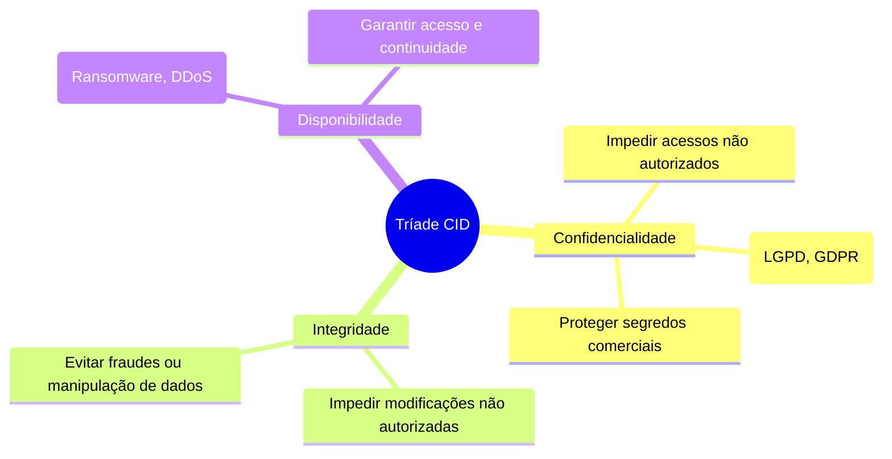
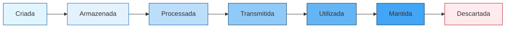

  

  <h1>🛡️ Security Management: IAM & Vulnerability</h1>
  
<em>Gestão de Vulnerabilidades e Resposta a Incidentes</em>

  

    
    
  

---

## 📖 Sobre a Disciplina

A disciplina de **Security Management (Vulnerability and Response)** tem como premissa capacitar no entendimento profundo do que é a informação e sua importância para os negócios. Com base em frameworks como **ITIL v4** e melhores práticas de segurança, o conteúdo aborda desde a estruturação de Segurança da Informação (SI) até metodologias práticas de Resposta a Incidentes e Gestão de Vulnerabilidades.

> **Observação:** O conteúdo desta página baseia-se no PDF "Management Aula 001" (único material disponível na pasta do projeto).

## 🎯 Principais Objetivos

- **Definição e Valor:** Identificar o que é e qual a importância da informação para o negócio.
- **Gestão de Riscos (GRC):** Mapear, identificar e gerenciar os riscos de SI.
- **Resposta a Incidentes:** Traçar estratégias eficazes frente a violações.
- **Gestão de Vulnerabilidades:** Teoria e prática na proteção de ativos e gestão de identidades e senhas (**IAM**).
- **Conscientização:** Defesa contra Engenharia Social através de programas e campanhas (ex: *Ethical Phishing*).

---

## 🛡️ Pilares da Segurança da Informação (Tríade CID)

Garantir que a empresa opere sem interrupções críticas minimizando riscos. Os três pilares fundamentais são:

---

## 🔄 Ciclo de Vida da Informação

A informação não é estática, ela deve ser protegida continuamente de acordo com seu **valor intrínseco**:

---

## 🧠 Estrutura do Conhecimento

A evolução até a tomada de decisão estruturada segue uma cadeia lógica:

1. **Dado:** Elemento bruto sem contexto (ex: "1.200 acessos").
2. **Informação:** Dados com contexto (ex: "1.200 acessos ocorreram em julho").
3. **Conhecimento:** Interpretação da informação (ex: "acessos estão 20% acima da média").
4. **Sabedoria:** Capacidade de agir com base ética e estratégia de longo prazo.

---

## 👩‍🏫 Docência e Contato

**Professor: José Ricardo Machado**
- 🎓 _Coordenador de Infraestrutura, Arquitetura e GRC no SOC da Embratel_
- 💼 Experiência: 16+ anos em TI, Segurança, IAM, Gestão de Riscos e Compliance.
- 📧 Contato: `profjose.machado@fiap.com.br`

---

  
Feito com 💻 e 🛡️ para documentação de aulas.

